# Red Hat OpenShift - Desplegar MySQL ☁

## Índice  📰
1. [Pre-Requisitos](#Pre-Requisitos-pencil)
2. [Desplegar base de datos MySQL](#Desplegar-base-de-datos-MySQL-floppy_disk)
4. [Acceso a la base de datos](#Acceso-a-la-base-de-datos-computer)
5. [CRUD con IBM Cloud Shell](#CRUD-con-IBM-Cloud-Shell-hammer)
6. [Referencias](#Referencias-mag)
7. [Autores](#Autores-black_nib)
<br />

## Pre Requisitos :pencil:
* Contar con una cuenta en <a href="https://cloud.ibm.com/"> IBM Cloud</a>.
* Contar con un clúster en OpenShift.
<br />

## Desplegar base de datos MySQL :floppy_disk:
Para realizar el despliegue de una base de datos MySQL en un clúster de OpenShift, complete los siguientes pasos:
<br />

1. Dentro de su cuenta de *IBM Cloud* acceda al ```IBM Cloud Shell``` dando click en la pestaña <a href="https://cloud.ibm.com/shell"> </a>, que se ubica en la parte superior derecha del portal. 
<br />

<p align="center">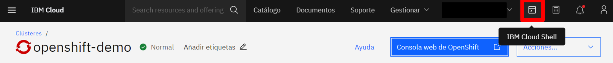</p>

<br />

2. Ingrese a la consola web de OpenShift presionando el botón ```OpenShift web console```. 
<br />

<p align="center">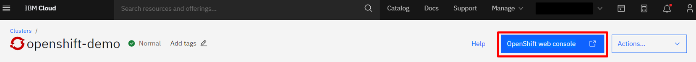</p>

<br />


3. Posteriormente de click sobre su correo (parte superior derecha) y luego en la opción ```Copy Login Command```. Una vez cargue la nueva ventana, de click en la opción ```Display Tokeny```. Copie el comando que sale en la opción ```Log in with this token``` y colóquelo en el IBM Cloud Shell para iniciar sesión y acceder a su clúster de OpenShift.
<br />

<p align="center">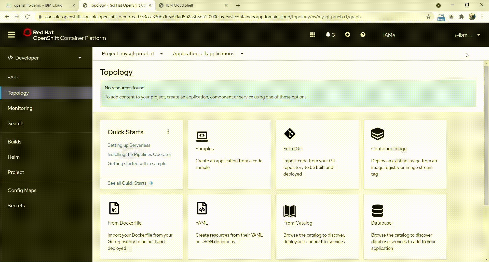</p>

<br />

<p align="center">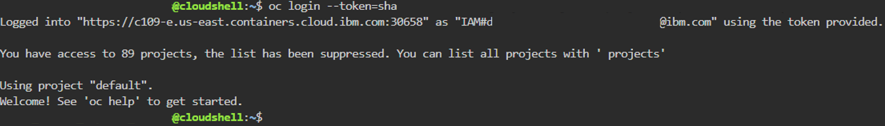</p>

<br />

4. En la consola de OpenShift cree un nuevo proyecto. Para ello, asegúrese de estar en el rol de ```Developer```, de click en la pestaña ```Project``` y luego ```Create Project```. Allí, asígne un nombre y de click en el botón ```Create```.
<br />

<p align="center"></p>

<br />

5. Acceda al proyecto creado en IBM Cloud Shell. Para ello utilice el comando:

   ```
   oc project <nombre_proyecto>
   ```

   Ejemplo:

   ```
   oc project mysql-project
   ```
   <br />

   <p align="center">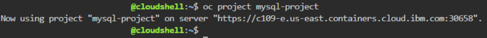</p>

   <br />

6. Realice una búsqueda en el catálogo sobre los recursos relacionados con MySQL que pueden ser desplegados en el clúster. Para ello coloque el comando:

   ```
   oc new-app --search mysql
   ```
   <br />

   <p align="center">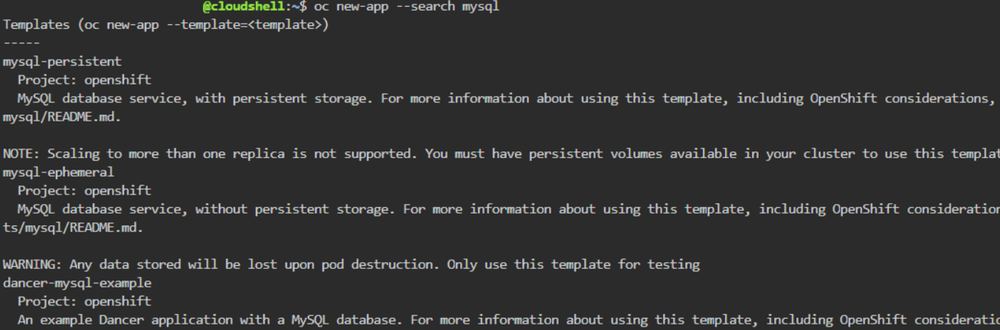</p>

   <br />

7. Despliegue el template de MySQL. Para este caso hay dos opciones que puede utilizar:
   * Sin almacenamiento persistente (```mysql```).
   * Con almacenamiento persistente (```mysql-persistent```).
   <br />
   
   Para este caso, se utiliza la plantilla con almacenamiento de volumen persistente, ya que esto permite que los datos sobrevivan y no se pierdan cuando el pod se reinicie. Por otro lado, en el despliegue se deben indicar algunas variables de entorno para la configuración del servidor. Utilice el comando:
   
   ```
   oc new-app mysql-persistent --param=MYSQL_USER=user --param=MYSQL_PASSWORD=pass --param=MYSQL_DATABASE=prueba --name mysql
   ```
   
   > NOTA: Las varibles definidas permiten configurar el usuario, contraseña y nombre de la base de datos MySQL. Estos datos se necesitarán más adelante cuando acceda a la base de datos.
   <br />

   <p align="center">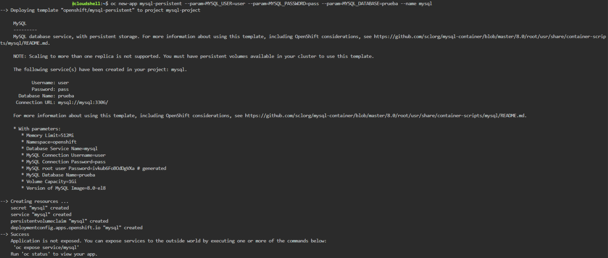</p>

   <br />

8. Verifique el estado de implementación de la base de datos. Para ello coloque el comando:

   ```
   oc status
   ```
   <br />

   <p align="center">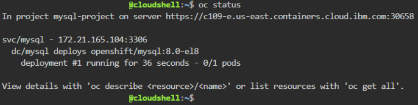</p>

   <br />

9. Obtenga los pods de MySQL y verifique que el despliegue se ha completado con éxito. Utilice el comando:

   ```
   oc get pods
   ```
   <br />

   <p align="center">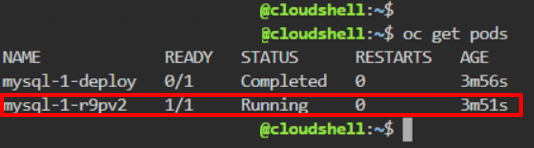</p>

   <br />


## Acceso a la base de datos :computer:
Para acceder a la base de datos MySQL que ha desplegado en el clúster de OpenShift siga los pasos que se muestran a continuación:
<br />

1. Abra una sesión de shell remota en un contenedor. Para ello, utilice el siguiente comando reemplazando ```<pod>``` con el nombre del pod de MySQL cuyo estado es ```running```:

   ```
   oc rsh <pod>
   ```
   
   Ejemplo:
   
   ```
   oc rsh mysql-1-r9pv2
   ```
   <br />

   <p align="center">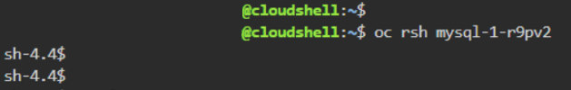</p>

   <br />

2. Para acceder con las credenciales definidas en el despliegue de MySQL coloque:

   ```
   mysql -u user -p
   ```
   <br />
   
   Una vez ejecute el comando, coloque la contraseña establecida (```pass```) y presione enter para continuar. Si la contraseña es correcta, accederá con exito a la base de datos.
   
   <br />

   <p align="center">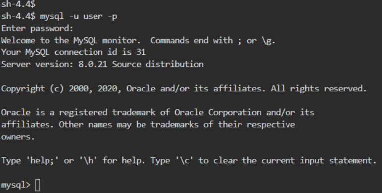</p>

   <br />


## CRUD con IBM Cloud Shell :hammer:
Una vez ha desplegado y accedido a la base de datos MySQL en OpenShift, se continúa el ejercicio con las operaciones del CRUD (Create, Read, Update & Delete). Para ello, se presentan a continuación los pasos que se deben realizar para llevar a cabo cada una de estas operaciones:
<br />

1. Visualice las instancias de base de datos. Para ello, utilice el comando:

   ```
   show databases;
   ```
   <br />

   <p align="center">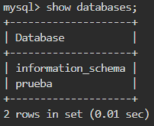</p>

   <br />
   
2. Seleccione la instancia creada durante el despliegue de la base de datos (```prueba```) con el comando:

   ```
   use prueba;
   ```
   <br />

   <p align="center">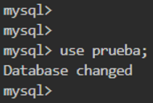</p>

   <br />
   
3. Cree una tabla que contenga los datos y tipos de datos que se solicitan para completar los campos. Use el comando:

   ```
   CREATE TABLE nombre_tabla (id serial, columna_1 tipo_dato, columna_2 tipo_dato, ... , columna_n tipo_dato, primary key (id));
   ```
   
   Ejemplo:
   
   ```
   CREATE TABLE empleados (id serial, nombre varchar(30), apellido varchar(30), ciudad varchar(30), cedula integer, cargo varchar(30), empresa varchar(30), fecha date, primary key (id));
   ```
   <br />

   <p align="center">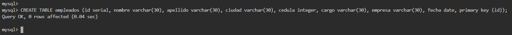</p>

   <br />
   
4. Observe la tabla con el siguiente comando:

   ```
   select * from nombre_tabla;
   ```
   
   Ejemplo:
   
   ```
   select * from empleados;
   ```
   
   > NOTA: como no ha registrado ningún dato en la tabla obtendrá una respuesta *Empty*.
   
   <br />

   <p align="center">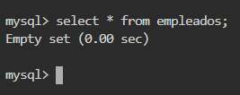</p>

   <br />

5. Agregue datos a la tabla con el siguiente comando:

   ```
   INSERT INTO nombre_tabla (columna_1, columna_2, ... , columna_n) VALUES(valor_1, valor_2, ... , valor_n);
   ```
   
   Ejemplo:
   
   ```
   INSERT INTO empleados (nombre, apellido, ciudad, cedula, cargo, empresa, fecha) VALUES('Diana', 'Espitia', 'Bogotá', 1234567890, 'Intern', 'IBM', '2021-09-27');
   ```
   <br />
   
   Visualice la tabla e identifique los datos agregados.
   
   ```
   select * from nombre_tabla;
   ```
   
   Ejemplo:
   
   ```
   select * from empleados;
   ```
   <br />

   <p align="center">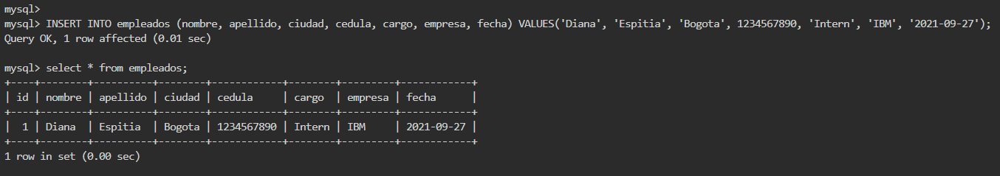</p>

   <br />
   
6. Actualice los datos de la tabla teniendo en cuenta el ID en cada caso. Para ello, utilice el comando:

   ```
   UPDATE nombre_tabla set columna_1=valor_nuevo where id=x;
   ```
   
   Ejemplo:
   
   ```
   UPDATE empleados set nombre='Andrea' where id=1;
   ```
   <br />
   
   Visualice la tabla e identifique los datos agregados.
   
   ```
   select * from nombre_tabla;
   ```
   
   Ejemplo:
   
   ```
   select * from empleados;
   ```
   <br />

   <p align="center">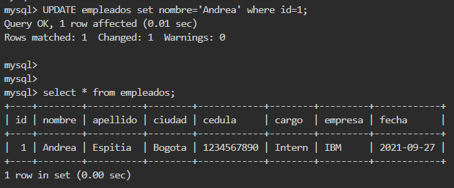</p>

   <br />

7. Elimine los datos de la tabla teniendo en cuenta el ID en cada caso. Use el comando:

   ```
   DELETE FROM nombre_tabla WHERE id=x;
   ```
   
   Ejemplo:
   
   ```
   DELETE FROM empleados WHERE id=1;
   ```
   <br />
   
   Visualice la tabla e identifique los datos agregados.
   
   ```
   select * from nombre_tabla;
   ```
   
   Ejemplo:
   
   ```
   select * from empleados;
   ```
   <br />

   <p align="center">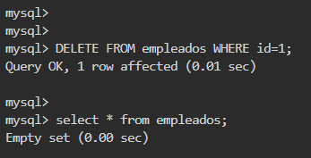</p>

   <br />
   
<br />

## Referencias :mag:
* <a href="https://cloud.ibm.com/docs/databases-for-postgresql?topic=databases-for-postgresql-getting-started"> Get Started PostgreSQL</a>.
<br />


## Autores :black_nib:
Equipo IBM Cloud Tech Sales Colombia.
<br />
